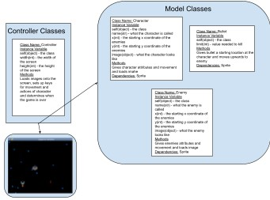

 Warning: Everything between << >> needs to be replaced (remove << >> after replacing)
# CS110 Project Proposal
# << Project Title >>
## CS 110 Final Project
### << Semester, Year >>
### [Assignment Description](https://docs.google.com/document/d/1H4R6yLL7som1lglyXWZ04RvTp_RvRFCCBn6sqv-82ps/edit#)

<< [repl](#) >>

<< [link to demo presentation slides](#) >>

### Team: Group 9
#### Thomas Britt, Daly Olivert, Kia Eshraghi

***

## Project Description *(Software Lead (Daly Olivert))*

We tried to make a Space Invaders game. We intended on having waves of enemies coming at the player. The aliens would all move in one direction until they hit one of the boundaries, and once that happens they were supposed to gone down a little bit on the y-axis and head towards the opposite direction (left until it hits boundaries, goes down a little bit, then goes to the right and repeat.) We weren't able to get the lazer working, but if they were to work the would have been able to kill the aliens. The part that was supposed to makes this game challenging was the cool down on being able to fire the weapon. This would have made it so that the player would have to time when to shoot. Although this idea seems simple, the waves of enemies can soon enough become overwhelming. The score would be kept at the top right and the health would be at the top left. 

***    

## User Interface Design *(Front End Specialist)*

* etc/sketchupCS110.jpg, inital sketchup and explanation
  character originally intended to move left and right only, up and down were implemented
*  etc/GUICS110.PNG, final GUI
  correct sized background and other sprites implemented, no menu as planned, but also no health and score on the screen.

***        

## Program Design *(Backend Specialist)*

* Non-Standard libraries
  * Pygame
    * For each additional module you should include
        * url for the module documentation
        * a short description of the module
* Class Interface Design
        * 
    * This does not need to be overly detailed, but should show how your code fits into the Model/View/Controller paradigm.
* Classes
  * Character Class: The character that the user controls
  * Enemy Class: The characters that attack the player
  * Bullet Class: How the player character attacks enemies
  * Controller Class: Controls how the previous classes interact with each other and how the player character is controlled

## Project Structure *(Software Lead)*

The Project is broken down into the following file structure:

* main.py
* src
    * <all of your python files should go here>
* assets
    * <all of your media, i.e. images, font files, etc, should go here)
* etc
    * <This is a catch all folder for things that are not part of your project, but you want to keep with your project. Your demo video should go here.>

***

## Tasks and Responsibilities *(Software Lead)*

   * You must outline the team member roles and who was responsible for each class/method, both individual and collaborative.
   * Daly
     * Organized meetings, oversaw the program
     * Worked with Controller and Enemy classes in coding the movement of the enemies
     * Removed background from images
     * used the testing strategy to see if there was anything that was not working in the program
   * Tommy
     * Resized sprites to fit screen appropriately
     * Added bounds so that the character couldn't leave the screen
     * Worked with TAs to solve our errors
     * Implemented the controller class and loaded sprites and background onto the screen
     * Attempted bullet code, after hours with TA it still could not be resolved
     * Implemented a score system, didn't get to test
   * Kia
     * Coded the character, and bullet classes, also helped with the controller classes
     * worked on the controller class and attempted to code for the movements of the enemies
     * attempted to code for collision for the bullet and the enemy
     * helped test the program to check if there were any errors
       

  

### Software Lead - << Daly >>

<< Worked as integration specialist by... >>

### Front End Specialist - << Tommy >>

 Did research on sprite collision, setting boundaries to restrict movement, sprite resizing, bullet spawning(unsuccessful). The boundaries and sprite resizing were successful, but the rest proved challenging for the group.

### Back End Specialist - << Kia >>

I did research on how to load the images onto the screen and change the size of the images so that it would fit into the screen. I also did research on how to code movement into the direction of the characters. Lastly, I did research on what characterstics each class should have.

## Testing *(Software Lead)*

* << Describe your testing strategy for your project. >>
    * << Example >>

## ATP

| Step                  | Procedure     | Expected Results  | Actual Results |
| ----------------------|:-------------:| -----------------:| -------------- |
|  1  | Click Run Button | different type of enemies to attack player ||
|  2  | click space button  | player character shoots projectile ||
|  3  | click left arrow key  | player character moves left ||
|  4  | click right arrow key  | player character moves right ||
|  5  | click up arrow key  | player character moves up ||
|  6  | click down arrow key  | player character moves down ||
|  7  | projectile hits enemy  | player loses health/dies ||
|  8  | enemy collision with player  | player character loses health/dies ||
etc...
